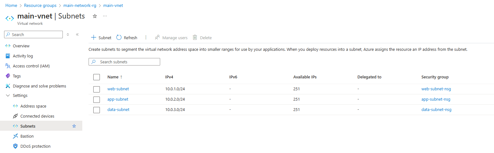

# Terraform Network Pattern

This README documents the advanced Terraform patterns implemented in our network infrastructure project. It covers techniques for managing complex, hierarchical data structures and transforming them into resource configurations.

## Table of Contents

1. [Project Overview](#project-overview)
2. [Hierarchical Data Modelling](#hierarchical-data-modelling)
3. [Key Terraform Functions](#key-terraform-functions)
4. [Data Transformation Techniques](#data-transformation-techniques)
5. [Dependency Management](#dependency-management)
6. [Best Practices](#best-practices)
7. [Resource Organisation](#resource-organisation)

## Project Overview

Our project creates a Virtual Network infrastructure in Azure using a hierarchical data structure:

- Virtual Networks
  - Subnets
    - Network Security Groups
      - Security Rules

The key innovation is the "super variable" approach that allows defining this hierarchy in a single variable, then transforms it into appropriate maps for resource creation.



## Hierarchical Data Modelling

### The "Super Variable" Pattern

We use a nested variable structure to define our entire network infrastructure:

```hcl
variable "virtual_networks" {
  type = map(object({
    name                = string
    address_space       = list(string)
    
    subnets = map(object({
      name             = string
      address_prefixes = list(string)
      
      network_security_group = optional(object({
        name = optional(string)
        rules = list(object({
          name                       = string
          priority                   = number
          # Additional properties...
        }))
      }))
    }))
  }))
}
```

### Benefits of Hierarchical Modeling

1. **Natural organisation:** The hierarchy mirrors the actual relationship between resources
2. **Single source of truth:** All infrastructure is defined in one place
3. **Reduced repetition:** Parent attributes can be referenced by child resources
4. **Self-documenting:** The structure makes the relationships clear

## Key Terraform Functions

### `flatten()`
The flatten() function converts a complex nested structure into a flat list:
```hcl
flatten([
  for net_key, net_value in var.virtual_networks : [
    for subnet_key, subnet_value in net_value.subnets : {
      # Properties...
    }
  ]
])
```

Before flattening (nested structure):

```hcl
{
  "main" = {
    subnets = {
      "web" = { ... },
      "app" = { ... }
    }
  }
}
```

After flattening (flat list):

```hcl
[
  { subnet properties for "web" },
  { subnet properties for "app" },
]
```

 ### `merge`
 The merge() function combines multiple maps into a single map:
 ```hcl
merge(
  subnet_value,
  {
    vnet_key           = net_key
    subnet_key         = subnet_key
  }
)
 ```

 Before merging:
 ```hcl
subnet_value = {
  name = "web-subnet"
  address_prefixes = ["10.0.1.0/24"]
}
 ```

 After merging:
 ```hcl
 {
  name = "web-subnet"
  address_prefixes = ["10.0.1.0/24"]
  vnet_key = "main"
  subnet_key = "web"
}
 ```

 ## `coalesce()`
The coalesce() function returns the first non-null value from a list of arguments:
```hcl
name = coalesce(subnet.network_security_group.name, "${subnet.name}-nsg")
```
If subnet.network_security_group.name is null, it falls back to "${subnet.name}-nsg". Good for setting default values.

## Conditional Expressions
The ternary operator (condition ? true_val : false_val) for conditional logic:
```hcl
source_port_range = length(security_rule.value.source_port_ranges) == 1 ? 
                     security_rule.value.source_port_ranges[0] : null
```
This checks if there's exactly one port range and uses it for the single-value field; otherwise, it sets it to null.

## String Interpolation and Formatting
Two equivalent ways to create composite keys:
```hcl
# String interpolation
"${entry.subnet_key}.${entry.vnet_key}"

# Format function
format("%s.%s", entry.subnet_key, entry.vnet_key)
```
Both create strings like "web.main".

## Data Transformation Techniques
### The Transformation Pipeline
Our typical transformation pipeline:

1. **Start with nested data** (hierarchical "super variable")
2. **Flatten the structure** (using flatten())
3. **Enrich with context** (using merge())
4. **Create a map with unique keys** (using for expression)

```hcl
locals {
  subnets = {
    for entry in flatten([
      for net_key, net_value in var.virtual_networks : [
        for subnet_key, subnet_value in net_value.subnets : merge(
          subnet_value,
          {
            vnet_key = net_key
            subnet_key = subnet_key
          }
        )
      ]
    ]) : "${entry.subnet_key}.${entry.vnet_key}" => entry
  }
}
```

### Filtering with Conditional Expressions
We can filter resources using conditional expressions in the for expression:
```hcl
network_security_groups = { 
  for key, subnet in local.subnets : key => merge(
    subnet.network_security_group,
    { # Additional properties... }
  ) if subnet.network_security_group != null 
}
```
This creates a map containing only subnets that have an NSG defined.

### Dynamic Blocks
Dynamic blocks create repeated nested blocks based on a collection:
```hcl
dynamic "security_rule" {
  for_each = each.value.rules
  
  content {
    name                       = security_rule.value.name
    priority                   = security_rule.value.priority
    # Other properties...
  }
}
```
This creates a security_rule block for each rule in the collection.

## Dependency Management
### Implicit Dependencies
Terraform automatically creates dependencies when one resource references another's attributes:
```hcl
resource "azurerm_subnet" "this" {
  # ...
  virtual_network_name = azurerm_virtual_network.this[each.value.vnet_key].name
  # ...
}
```
This creates an implicit dependency on the virtual network resource.

### Explicit Dependencies
For cases where implicit dependencies aren't sufficient, use depends_on:
```hcl
resource "azurerm_subnet" "this" {
  # ...
  depends_on = [azurerm_virtual_network.this]
}
```

## Best Practices

### Keys and Maps

1. **Create meaningful keys** that encode relationships ("web.main")
2. **Use the same key format** across resources that need to reference each other
3. **Keep keys consistent** throughout your configuration

### Locals.tf 

1. **Use locals for transformations** to make code more readable
2. **Place locals near the resources** that use them
3. **Break complex transformations** into multiple steps with intermediate locals

### Variable Structure

1. **Use optional attributes** for fields that aren't always required
2. **Provide sensible defaults** for optional fields
3. **Use type constraints** to document expected values

## Resource Organisation
```
├── main.tf              # Provider configuration
├── vnet.variables.tf    # All variable definitions
├── vnet.tf              # Virtual network resources and locals
├── subnet.tf            # Subnet resources and locals
├── nsg.tf               # NSG resources and locals
└── terraform.tfvars     # Variable values
```

This organisation:
1. Groups related resources together
2. Places locals in the resources that use them
3. Separates variables from implementation
4. Makes the configuration easier to navigate

## Conclusion

These advanced Terraform patterns allow us to manage complex infrastructures with hierarchical relationships in a maintainable way. By flattening nested data structures and maintaining relationships through keys, we can work with hierarchical data in Terraform's resource model.